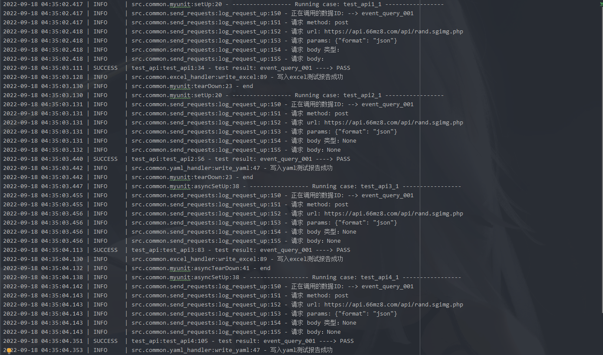
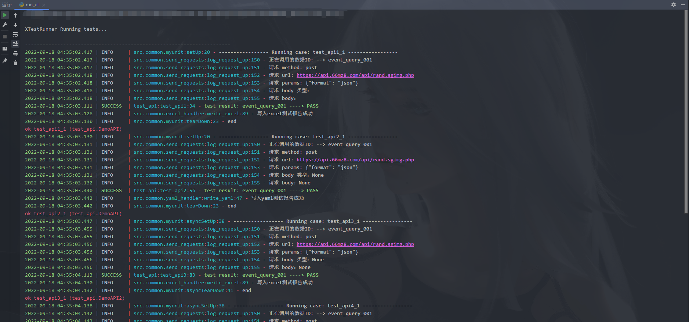
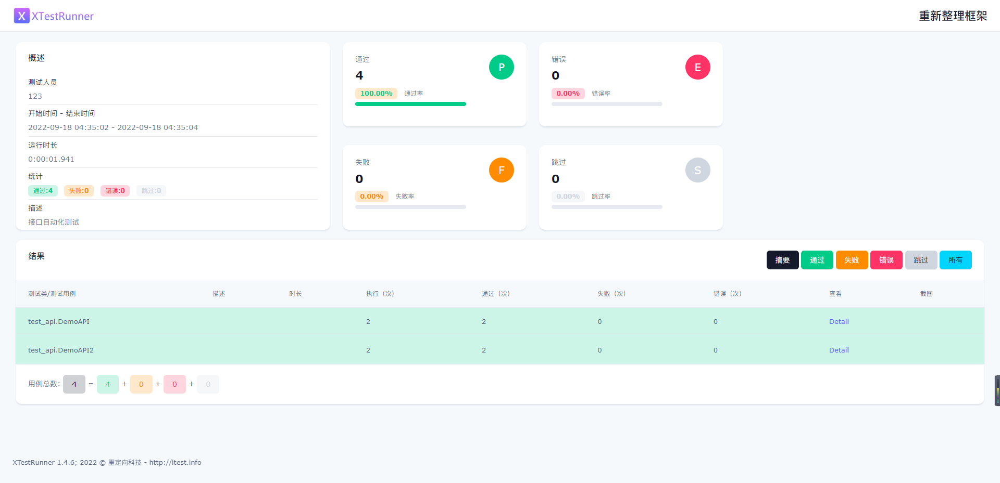

# python接口自动化测试框架

## 🧠设计思路

- python3 + unittest + ddt + requests / httpx / aiohttp

## 👀目录结构介绍

- common/: 公共类
- core/: 配置
- data/: 测试用例数据
- db/: 数据库
- log/: 日志
- templates/: 模板文件
- report/: 测试报告
- testcase/: 接口自动化测试项目和用例
- utils/: 工具包
- run_*.py: 执行测试用例主程序入口

## 👨‍💻👩‍💻使用

```shell
# 下载
git clone https://gitee.com/wu_cl/automated_api.git

# 安装依赖包
pip install -r requirements.txt
```

### 1: 指定用例所在目录

```
testcase 目录下的一级文件夹视为项目目录

在 config.py 配置中修改 PROJECT 为对应的项目目录名即可
```

### 2: 如何运行测试

```
run_all.py 运行项目下所有的用例

run_class.py 运行项目下指定测试类

run_thead.py 线程池运行项目下所有测试用例
```

### 3: 如何查看报告

```
运行完之后到 report 文件夹下查看
```

## ❓问题相关

### 1: 为什么日志没有内容

```
日志内容需要手动写入, 详细示例demo中几乎都有体现, 请自行查看
```

### 2: 为什么没有测试报告

```
html 仅执行 run_all.py 时自动创建
excel 需手动写入, 详情查看测试用例: testAPI.py
yaml 需手动写入, 详情查看测试用例: testAPI.py
```

### 2: excel 测试报告有问题

```
1: excel 测试数据要严格按照模板格式编写, 文件名字可以变, 文件中参数顺序不可以变,
存放位置与测试项目同步

2: excel 测试报告名称可自定义或默认
```

### 3: yaml 测试报告有问题

```
1: yaml 测试数据要严格按照模板格式编写, 文件名字可以变, 文件中参数顺序不可以变,
存放位置与测试项目同步

2: yaml 测试报告名称可自定义或默认
```

## 效果预览

日志:



控制台:



HTML报告:


